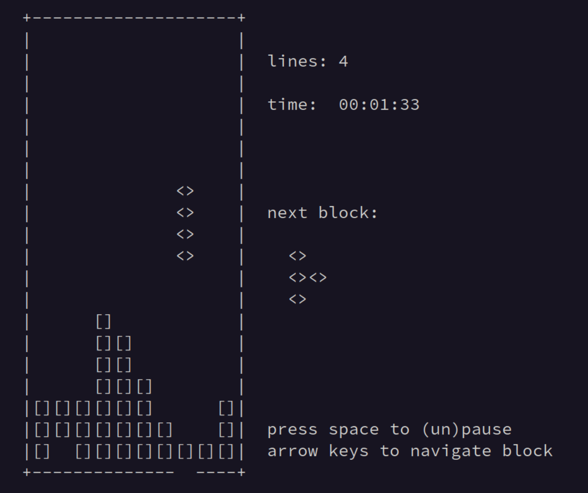

Telnetris
=========

This is a small Telnet server that offers a game of Tetris to its clients.
It is written in JavaScript and requires [Node.js](https://nodejs.org/) to
run.




Usage
-----

```
node telnetris.sh [port] [host]
```

By default, it will bind to **port 10023** and **host 0.0.0.0** (i.e. all
interfaces.)

If you want it to listen to the default Telnet port (23), you will likely
have to run the script as root (`sudo node telnetris.sh 23`.)

If run as root, the script will change its user and group to `nobody` after
creating the server socket.


### Using Docker

Alternatively, you can create a Docker container for this script like this:

```bash
# This will bind the server to port 23, the default Telnet port.
docker run --name telnetris --expose "0.0.0.0:23:10023" ghcr.io/hanzi/telnetris:latest
```


### Using Docker Compose

```yml
services:
  telnetris:
    image: ghcr.io/hanzi/telnetris:latest
    ports: [ "0.0.0.0:23:10023/tcp" ]
    restart: unless-stopped
```
